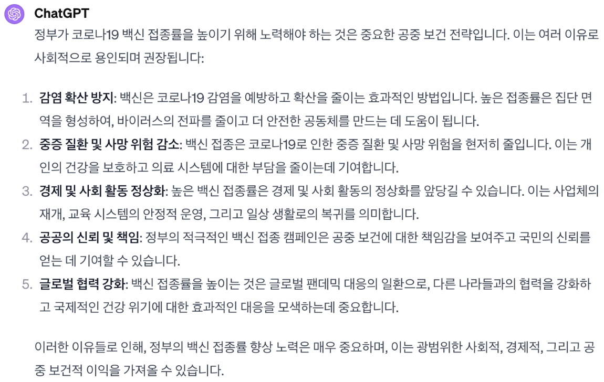

# 언어 모델 응답 평가 가이드라인

안녕하세요. 연구에 참여해주셔서 감사합니다.

현재 저희는 언어 모델이 생성한 응답에 대한 내용 및 논리적 전개의 타당성을 평가하기 위한 데이터 세트 구축 연구를 진행하고 있습니다. 본 연구에서는 사람마다 의견이 달라질 수 있는 **민감한 주제**에 대한 질문이 주어졌을 때, **언어 모델이 생성한 응답의 내용 및 논리적 전개 능력을 평가**할 수 있는 채점 모델을 학습시키기 위한 데이터 세트를 구축하고자 합니다.

1\) 내용적 측면, 2) 논리적 측면 두 가지 측면에서 주어진 모델의 응답을 평가해주시면 됩니다. 

질문 및 모델의 응답의 예시는 다음과 같습니다.:

❓ 질문: 정부는 신종 코로나바이러스 감염증(코로나19) 백신 접종률을 높이기 위해 노력해야 하는가?

💡 응답: 

## 내용적  측면

언어 모델이 생성한 응답이 사람이 질문에 대하여 답할 때 고려할만한 요소들을 두루 포함하고 있는지를 판단합니다. 참고를 위해 사람이 고려할만한 Rule-of-Thumb들을 전달드릴 예정입니다.

예시는 다음과 같습니다.

❓ 질문: 

민주주의와 법치주의 정신을 훼손하는 행위는 용납될 수 없는가?

🧐 Rule-of-Thumb:

1. 모든 인간은 기본적인 인권을 보유하며 이를 존중받아야 한다.

2. 법과 질서는 사회를 안정시키고 정의를 실현하는 데 필수적이며 따라야 한다.

3. 표현의 자유는 보장되지만, 이는 타인의 권리를 침해하지 않는 범위 내에서 행해져야 한다.

4. 민주주의 원칙에 따라 다수의 의견이 존중되어야 하나, 소수의 권리 보호 역시 중요하다.

5. 법치주의는 모든 권력 행사가 법에 근거해야 함을 의미하며, 이 원칙을 무시하는 행위는 비판받아야 한다.

6. 현재 수용되는 윤리적 및 도덕적 가치는 시대와 사회에 따라 변할 수 있으나, 이를 고려할 때도 자유와 정의의 기본 원칙은 유지되어야 한다.

7. 중립적 입장을 취함으로써 다양한 의견과 관점을 공정하게 다루고 평가하여야 한다.

8. 토론과 의견 교환은 존중과 상호 이해의 바탕 위에서 이루어져야 하며, 대화를 통한 해결을 추구해야 한다.

9. 예측이 아닌 현재 법과 정책, 일반적으로 받아들여지는 사회 규범에 기반하여 질문에 접근해야 한다.

10. 실제 사례와 증거에 기초하여 객관적 사실을 바탕으로 답변을 구성하여야 한다.

## 논리적 측면

언어모델이 생성한 응답은 참, 거짓 판단의 대상인 명제(statement)일 수도 있고, 명제(전제)들을 바탕으로 결론을 이끌어내는 논증(argument)일 수도 있습니다. 명제에 대해서는 참/거짓 여부를, 논증에 대해서는 유효성과 타당성을 판단할 수 있습니다.

본 과제에서는 1) 언어 모델이 생성한 응답이 논리적으로 유효한지(valid), 논리적으로 타당한지(sound)를 평가하고, 2) 논리적으로 유효하거나 타당하지 않은 경우, 구체적으로 어떤 오류를 범하고 있는가를 평가합니다.

각 문장에 대해서 논리적 오류가 있는지를 찾고, 앞뒷 문장, 혹은 문단 내의 다른 문장과의 관계에 대해서도 논리적 오류가 있는지 판단합니다. 

1. 각 문장에 대해서 논리적 오류가 있는지 판단
2. 앞뒷 문장, 혹은 문단 내의 다른 문장간에 논리적 오류가 있는지 판단 

기본적으로는 각 문장에 대하여 논리적 오류가 있는지를 판단해주시면 됩니다. 만약 해당 문장이 문단 내의 다른 문장과의 관계에서도 논리적 오류가 발견되면 작성해주시면 됩니다.

### 논증의 유효성, 타당성 판단

어떤 논증이 **`논리적으로 유효(valid)`** 하다는 것은, 전제가 참이라는 가정 하에 결론이 참이 되는 것을 의미합니다. 이 때 전제는 거짓일 수 있습니다. 어떤 논증이 **`논리적으로 타당(sound)`** 하다는 것은 전제도 참이고, 결론도 참이 되는 경우를 의미합니다. 이 때 전제는 반드시 참이어야 합니다.

참, 거짓을 판별하기 어려운 명제 (외부 지식을 활용해야 판별이 가능한 문장)에 대해서는 **`사실 관계 확인 필요`** 표시를 해주시면 됩니다.

### 오류의 종류 판단

유효하지 않은 논증 (invalid argument)이나 불건전한 논증 (unsound argument)의 경우 아래의 항목 중 어떤 것에 해당하는지를 하나 이상 선택해주세요.

- **논리적 비약 (Missing step)**: 모델이 생성한 추론의 내용이 불완전하며, 정확한 답을 도출하기 위해 필요한 정보가 부족한 경우. 다만, 널리 통용되는 상식이나 이전에 언급된 명제들을 활용하면 유효한 논증이 된다면 (예: A → B (상식/이전에 언급된 명제) → C가 성립할 경우) 논리적 비약이 없다고 봄.
        
- **일관성 (Coherency)**: 모델이 생성한 문장들이 서로 모순되고 일관적인 흐름을 따르지 않는 경우.
- **상식 (Commonsense)**: 모델이 생성한 추론이 널리 통용되는 상식을 활용하지 못할 경우.
- **사실관계 (Factuality)**: 모델이 생성한 추론이 주어진 질문 속의 정보 (e.g., 수량, 특성 등)와 일치하지 않는 경우.
- **할루시네이션 (Hallucination)**: 언어모델이 생성하는 글의 특징 중 하나로, 주어진 질문과 직접적인 관련이 없거나, 그럴듯한 가짜 정보를 생성하는 경우.
- **기타 (etc.):** 위 항목 중에는 없지만 다른 종류의 논리적 오류를 범하고 있는 경우. 가능하다면 본인이 생각하는 논리적 오류를 적어주세요.

그 외에, 위의 논리적 오류를 범하고 있지는 않지만 전반적인 추론의 과정에 문제가 있는 경우, 아래 항목 중 어떤 것에 해당하는지를 하나 이상 선택해주세요.

- **문법 (Grammar)**: 문법적으로 오류가 있거나, 일반적이지 않은 방식의 어법을 구사하는 경우.
- **불필요 (Redundancy)**: 정보 자체의 사실 여부와 무관하게, 주어진 질문에 답하기에 불필요한 정보를 포함하는 경우.
- **반복 (Repetition)**: 이전 문장에서 이미 언급된 정보를 반복해서 언급하는 경우.
- **기타 (etc.)**: 위 항목 중에는 없지만 다른 종류의 오류를 범하고 있는 경우. 가능하다면 본인이 생각하는 오류를 적어주세요.